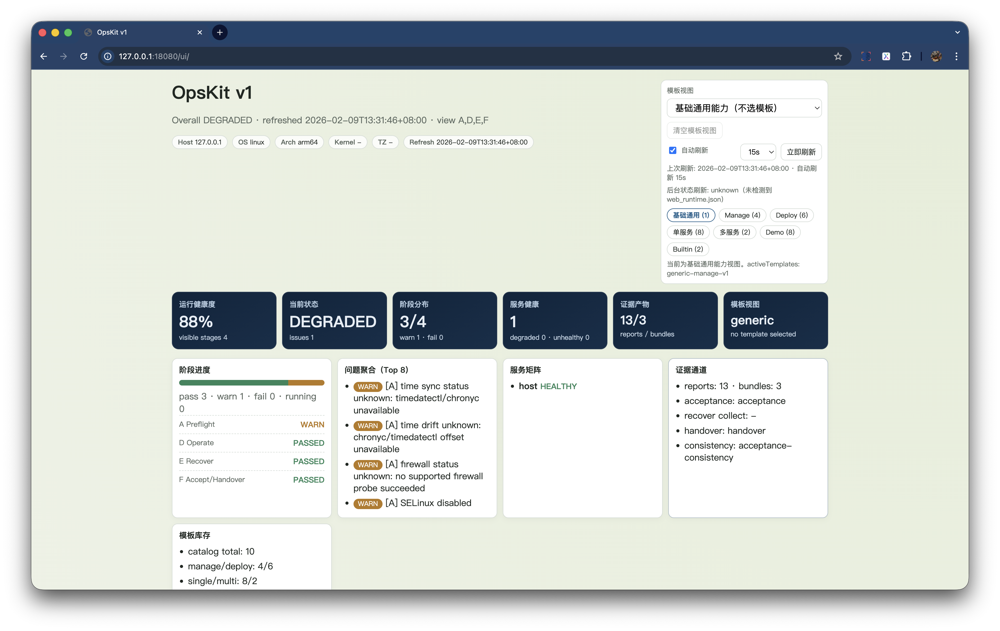

# UI 模板使用说明（只选择模板与查看结果）

## 1. 定位

OpsKit UI 仅用于：

- 选择模板视图（或无模板基础视图）
- 查看阶段状态（A-F）
- 查看证据入口（report / bundle）

OpsKit UI 不用于：

- 编辑模板
- 编辑 vars
- 承载执行逻辑

## 2. 使用步骤

1. 启动 Web：

```bash
opskit web --output /data/opskit-demo --listen 127.0.0.1:18080 --status-interval 15s
```

2. 打开页面：`http://127.0.0.1:18080/ui/`
3. 在右上角选择模板视图（或“基础通用能力”）。
4. 查看下方 A-F 卡片与状态大屏。
5. 点击证据入口进入 `reports/` 与 `bundles/`。

## 3. 自动刷新说明

- 前端自动刷新：周期拉取 `state/*.json`
- 后台状态刷新：由 `web --status-interval` 定时执行状态更新
- 页面会显示“后台状态刷新已启用/未启用”

## 4. 截图占位（建议）

当前占位图（latest）：




版本归档目录：

- `docs/assets/screenshots/releases/<version>/ui-template-stage.png`
- `docs/assets/screenshots/releases/<version>/ui-dashboard-evidence.png`

## 5. 通过 Docker 运行时截图（宿主机）

推荐在宿主机浏览器打开 UI 后截图（容器内一般没有桌面环境）：

```bash
docker run --rm -it \
  -p 18080:18080 \
  -v "$PWD/.tmp/opskit-demo:/data/opskit" \
  <your-opskit-image> \
  ./opskit web --output /data/opskit --listen 0.0.0.0:18080 --status-interval 15s
```

宿主机打开：`http://127.0.0.1:18080/ui/`

macOS 截图写入占位槽位（宿主机执行）：

```bash
bash /Users/darkrio/.codex/skills/screenshot/scripts/ensure_macos_permissions.sh
python3 /Users/darkrio/.codex/skills/screenshot/scripts/take_screenshot.py --app "Google Chrome" --path docs/assets/screenshots/latest/ui-template-stage.png
python3 /Users/darkrio/.codex/skills/screenshot/scripts/take_screenshot.py --app "Google Chrome" --path docs/assets/screenshots/latest/ui-dashboard-evidence.png
```

## 6. 截图版本同步（随版本更新）

发版前执行：

```bash
scripts/screenshot-sync.sh --version v0.4.2-preview.1
scripts/screenshot-check.sh --version v0.4.2-preview.1
```

说明：

- `screenshot-sync.sh`：把 `latest/` 的截图复制到对应版本目录
- `screenshot-check.sh`：校验 latest 与版本目录的截图文件是否齐全
